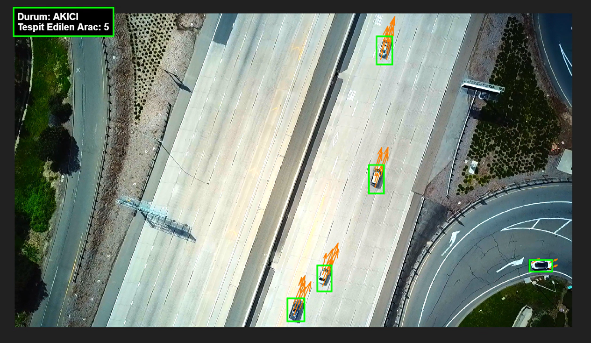

# 🛸 Otonom Takip Sistemi
**Hareketli Kameralar İçin Sarsıntı Sönümleme ve Dinamik Hedef Tespiti**

Bu proje, hareketli kameralardan (örneğin hava araçları, sarsıntılı platformlar veya hareket halindeki araçlar) alınan görüntülerde, kameranın kendi hareketini (Ego-Motion) algoritmik olarak sönümleyerek yeryüzündeki hareketli hedefleri stabil bir şekilde tespit eden bir Bilgisayarlı Görü (Computer Vision) mimarisidir.

 

## 🔬 Sorun Tanımı ve Mühendislik Yaklaşımı

Hareket eden bir platformdan, yerdeki hareketli bir hedefi tespit etmek literatürdeki en zorlu problemlerden biridir. Klasik statik algoritmaların saha şartlarında (rüzgar, sarsıntı, ışık değişimleri) yetersiz kalması üzerine, sistem iteratif bir geliştirme süreciyle tamamen dinamik bir mimariye evrilmiştir:

### ❌ Karşılaşılan Zorluklar (Neden Klasik Yöntemler Çalışmadı?)
1. **GMM (Gaussian Mixture Model) Yanılgısı:** Başlangıçta arka plan çıkarımı için kullanıldı. Ancak GMM kameranın sabit olduğunu varsayar. Kamera rüzgarda hafifçe titrediğinde, yüksek dokulu çimenleri ve ağaçları hareket eden devasa hedefler zannederek sistemi kilitledi.
2. **Sabit ROI ve Renk Filtrelerinin İflası:** Gürültüyü engellemek için ekranın belli kısımlarını veya "yeşil" rengi maskelemek denendi. Ancak kamera dönüş (pan) yaptığı an koordinatlar kaydı; güneş yansımaları ve gölgeler renk filtrelerini geçersiz kıldı.
3. **Aşırı Bölütleme (Over-segmentation) Sorunu:** Tespit edilen hedeflerin detaylı takibi yapılmaya çalışıldığında, araçların pürüzsüz tavanları ve cam yansımaları yüzünden sistem tek bir aracı 3-4 farklı parça gibi algıladı. Ekranda 5 araç varken sayacın 70'lere fırladığı görüldü.

### ✅ Nihai Çözüm: Vektörel ve Morfolojik Sistem Mimarisi
Dış etkenlere duyarlı statik algoritmalar yerine, çevresel faktörleri matematiksel olarak elimine eden şu yapı kurulmuştur:

1. **Dijital Gimbal (KLT & Rigit Dönüşüm):** Sistem, `MinEigenFeatures` ve KLT algoritması ile asfalttaki sabit referans noktalarını tespit eder. Bu noktaların anlık yer değiştirmesinden bir Dönüşüm Matrisi (`estimateGeometricTransform2D`) hesaplanır ve geçmiş kareler anlık kareye hizalanarak (`imwarp`) sarsıntı %100 sönümlenir.
2. **Bağıl Optik Akış (Relative Velocity):** Arka plan sabitlendikten sonra, Farneback algoritması ile anlık hız vektörleri hesaplanır. Sadece kameranın kendi hareketinden bağımsız, kendi motor gücüyle ilerleyen gerçek hedefler süzülür.
3. **Morfolojik Hedef Birleştirme:** Aşırı bölütleme (tek aracın bölünmesi) problemini çözmek için `imclose`, `imfill` ve `bwareaopen` filtreleri kullanılarak parçalar "kaynak yapılmış" ve her hedef bütünleşik, katı bir Bounding Box (Sınırlayıcı Kutu) içerisine alınmıştır.
4. **Akıllı Durum Analizi:** Tespit edilen anlık araç yoğunluğuna göre sistem, durumu 5 kademede (Boş, Akıcı, Hareketli, Yoğun, Sıkışık) otonom olarak sınıflandırır.

## 🛠️ Kurulum ve Kullanım

- **Gereksinimler:** MATLAB R2021a veya üzeri, Computer Vision Toolbox, Image Processing Toolbox.
- Repoyu bilgisayarınıza klonlayın.
- `main.m` dosyasındaki `source` değişkenini kendi test videonuzun yolu ile güncelleyin.
- MATLAB komut penceresinde `main` komutunu çalıştırarak sistemi başlatın.

---
**Geliştirici:** Aleyna Yıldırım
